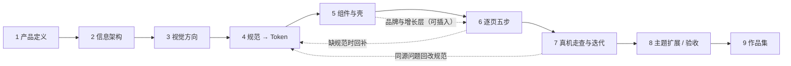

# AI 辅助 UI/UX 设计与开发工作流模板 v2.0

> 版本：v2.0 · 2026-10-10。在 v1.4（2026-10-01，原文见 `docs/workflow.md` 附录）上并入「慢牛 Milo」的实战经验：2026-10-03 → 10-10，七天，371 个提交，多个对话窗口接力，一次真机走查 29 条，一次全局换肤（浅色）。
> 适用：同 v1.4。移动优先的 App / Web 产品，从 0 做到可交付 MVP，或对已有原型做规范化重构。
> 首批套用：食律 NutriFlow v2（v1.x）；慢牛 Milo / GYMLOG（v2 的来源）。
> 原则不变：**只以产出门禁验收，不划分人与 AI 的职责。**
> 读法：先读「一页结论」和 §0；§1「十条最贵的教训」是速览；正文每条新规矩后面的【Milo：…】写的是出处，下一个项目据此判断要不要照搬。

---

## 一页结论：v2 相对 v1.4 改了什么

| # | v1.4 | v2 | 为什么（Milo 的教训） |
|---|---|---|---|
| 1 | Figma 是视觉规范的唯一源头 | **仓库里的 Token 文件是唯一源头**（`tokens.json` → 脚本生成 CSS 变量、TS 常量、Figma 插件）；Figma 由插件从仓库导入，只用来展示 | 两边各改一处必然分叉；AI 改仓库最快，Figma MCP 逐次调用慢且易错 |
| 2 | 线框放 Figma Wireframes 页 | **HTML 线框**：引擎实算的真数据 + 真实素材 + **手指热区**（拇指可达区底图 + 每个命中框的尺寸） | 数据真实、能截图进门禁、热区能自动量 |
| 3 | 方向稿只在阶段 3 做一次 | **方案台常驻**（`/preview`）：视效 / 组件的待选方案实时渲染并排，可自由组合，组合写进地址栏；选定后改默认，**旧默认和落选方案不删** | 视效靠静态图比不出来；作品集要展示选择过程 |
| 4 | 附录 F 单页门禁靠人逐项勾 | **自动门禁**：`check`（类型 · 单测 · 写死值 · Token 对比度 · 构建）+ `gate`（全流程 × 两种宽度）+ **逐像素回归**（已定稿的主题）+ **跨主题角色对等**（焦点色）；用户每立一条规矩，门禁就加一条断言 | 规矩靠记忆一定会破；几百次迭代不走样全靠它 |
| 5 | `docs/tasks/` 一页一张任务卡 | 每页 **五步**（五层 + 热区线框 → Stitch 参考 → 高保真 → 用户审查 → 定稿植入），五层分析写在**页面文件头注释** | 少一份会过期的文件；改页面的人一打开就看到为什么这样做 |
| 6 | `changelog.md` | **决定记录**：日期 · 决定 · **用户原话** · 谁定的（用户 / 授权 Claude / Claude 判断） | 换窗口后新 AI 只能靠文字理解「为什么」，原话比转述准 |
| 7 | （未规定） | **协作协议**：拍板材料直接推到窗口、授权分级、汇报只讲结果 | 用户时间最贵；过程汇报会拖慢开发 |
| 8 | （未规定） | **会话与上下文管理**：交接模板、绝不被自动压缩、限额、密钥约定 | 自动压缩丢过两次上下文；密钥反复丢 |
| 9 | 阶段 6 结束即交付 | 新增 **阶段 7 真机走查与迭代**：批注 → 逐项根因 → 同源归组 → 写进规范 → 分阶段 → 每阶段汇报 | 结构性问题只在真机上暴露（训练页被整页并入首页） |
| 10 | 深浅色只在附录 F 提一句 | 新增 **阶段 8 主题扩展** = Token 体系的验收；**另一套主题不是反色**，按「角色」对等 | 浅色做了五轮：深色岛、发暗、发脏、描边、焦点色被换黑 |
| 11 | 交付走 PR | 本机门禁过了**直接推主干**，CI 后台跑；推完**在线上包里核对这次的提交号** | PR / CI 来回太拖；「以为上线了」发生过多次 |
| 12 | （未规定） | **素材管线**（AI 出图 → 抠图 → 入库）、**演示数据要设计**、**演示页**（电脑左讲解右手机） | 作品集项目的观看入口就是演示页 |
| 13 | 附录 G 有一张样机坑表 | 新增 **§12 坑表**（症状 → 原因 → 处理），按前端 / 门禁 / 部署 / 设计决策 / 会话分类（素材的坑在 §10） | 同一个坑不同窗口踩了不止一次 |

---

## 0. 核心原则（v2）

1. **规范先于界面**：视觉规范冻结之前，不生成任何业务页面。（v1.4）
2. **仓库是唯一源头**：Token 在仓库的一个数据文件里定义，CSS、代码常量、Figma 都由脚本生成；任何地方都不手改生成物。（v1.4 第 2 条改）
3. **一次只做一页，每页只依赖文件**：不依赖对话记录或临时约定——对话会被压缩、窗口会换、AI 会换。（v1.4）
4. **缺规范先补规范**：页面需要规范里没有的东西，先补 Token / `DESIGN.md` / 组件，再继续。（v1.4）
5. **每一步有过关标准，能自动查的不靠人记**：每条规矩尽量落成一条门禁断言。（v1.4 第 5 条加强）
6. **只看产出，不分角色**。（v1.4）
7. **用户拍板的才定稿**：视觉 / 交互的选择由用户点头；视效类选择必须**实时渲染并排比**，不拿静态图比；**旧方案不删**。【Milo：方案台进工作流，2026-10-07】
8. **用户原话是规格**：每条决定连同原话、日期、谁定的记进决定记录；后来的人按原话判断，不按转述。【Milo：浅色那轮靠原话「深色模式的页面已经是完全固定的」守住了深色】
9. **同源问题归组改，改规范不改一页**：一条反馈先问「还有哪几页是同一个原因」，改法写进 `DESIGN.md`，全局一次改完。【Milo：走查 1 的 29 条归成 A–J 十组】
10. **目标决定范围，少做但做完整**：先问这件事为谁做（上线？作品集？），不值得展示 / 用不上的直接划掉；做的部分把数据态、空态、动效做全。找现成的、少写新代码，「无必要勿增实体」。【Milo：2026-10-06 目标改作品集后划掉 7 项；「App 观看率低于作品集，不是十分必要的工作可以省略」】
11. **定稿的东西有作用域保护**：已经定稿的页面 / 主题，后续改动只能写在新作用域里（例如只改浅色的 Token 值和 `[data-theme='light']` 规则），并用逐像素回归证明旧的一像素没动。【Milo：「深色模式的页面已经是完全固定的」】
12. **结论先行、只讲结果**：给用户的话先说结论；汇报只说改了什么、线上能不能看，不说 PR、CI、命令这些过程。【Milo：用户 2026-10-06】

**工具**

| 用途 | 工具 | v2 说明 |
|---|---|---|
| Token 与规范源头 | 仓库里的 `tokens.json` + 生成脚本 | 生成 CSS 变量、TS 常量、Figma 插件、对比度表 |
| 视觉规范展示 | Figma（插件从仓库导入） | 不在 Figma 里改值 |
| 视觉方向 / 页面参考 | Stitch（多方案）、Nano Banana 等出图工具 | 只当参考，不当规范 |
| 代码 | vibe coding 客户端（Claude Code、Codex、Cursor……） | 根目录放 `CLAUDE.md` / `AGENTS.md` 当入口 |
| 自动门禁 | Playwright（无头 Chromium）、单测框架、自写检查脚本 | 见 §7 |
| 部署 | 静态托管（Vercel 等）+ CI 打包（安卓 APK） | 推主干自动部署 |
| 默认技术栈 | React + CSS Modules / Tailwind（可替换） | Milo 用 React 19 + Vite + CSS Modules + Capacitor |

---

## 1. 十条最贵的教训（速览）

| # | 发生了什么 | 现在的做法 | 在哪一节 |
|---|---|---|---|
| 1 | 对话被自动压缩两次，丢了约定和进度 | 每次推主干顺手更新交接文件；只在逼近极限时换窗口；发现被压缩先写交接 | §9 |
| 2 | 标杆页「没有设计感、达不到 V1 水准」被退回 | 退回时不在表现层修，回五层模型从结构层改起 | §3 阶段 3 |
| 3 | 独立训练页在真机上被否，整页并入首页 | 能装到手机上就尽早真机走一遍主流程；结构问题只在真机暴露 | §3 阶段 7 |
| 4 | 屏上同时出现两个计时器 | 「同一个东西屏上只出现一次」，切页时是同一个元素飞过去 | §6 第 10 条 |
| 5 | 浅色做了五轮：深色岛 → 发暗 → 发脏 → 描边 → 焦点色被换成黑 | 另一套主题按「角色」对等不按明暗反转；脚本逐元素比对两套主题 | §3 阶段 8 |
| 6 | 真机走查 29 条批注 | 逐项根因 → 同源归组 → 写进规范 → 分阶段 → 每阶段汇报 | §3 阶段 7 |
| 7 | 视效方案用静态截图比不出差别 | 方案台实时渲染并排 + 自由组合 | §5 |
| 8 | 以为上线了其实没上（部署被跳过）；也有反过来的——拿本地包哈希比线上，误判「没部署」 | 构建时把提交号打进包里，推完在线上包里搜提交号 | §8、§12 |
| 9 | 设计工具密钥反复丢、反复向用户要 | 约定存放位置、每次交接告知；平台层面配环境密钥 | §9 |
| 10 | 门禁中途反复跑、整套连跑拖慢开发 | 门禁放后台、做完再跑、失败只重跑失败项；日常只跑改到的 | §7 |

---

## 2. 流程总览（v2）



| 阶段 | 核心产出 | 过关标准（摘要） |
|---|---|---|
| 1 产品定义 | `brief.md`（含决定记录） | 目标可衡量；P0 都在闭环上；口径只有一个版本；非目标写明 |
| 2 信息架构 | `ia.md`、`mock/`、HTML 灰阶线框 + 热区 | 每个 P0 有规格；流程无断头页；线框标出第一优先 / 主操作 / 导航，命中框 ≥ 48 |
| 3 视觉方向 | `references.md`、视觉语言、方向稿 | 能说清与竞品的视觉差异；选定理由已记录 |
| 4 规范 → Token | `tokens.json` → 生成物、`DESIGN.md`、`/spec` | 标杆页全部用规范；对比度表两套主题全过 |
| 5 组件与壳 | 组件库、`/playground`、App 壳、`/demo` 雏形 | 全部组件 × 全部交互态；无写死值；目录测试覆盖每个导出 |
| 6 逐页五步 | 页面、方案台条目、门禁断言 | 每页 ①②④ 用户点头；`check` + `gate` 全绿；线上可看 |
| 7 真机走查与迭代 | 走查分析与计划、每阶段汇报 | 每条批注有根因与归组；规则写进 `DESIGN.md` 并进门禁 |
| 8 主题扩展 | 第二套语义色映射、主题对等检查 | 组件一行不改即可换肤；旧主题逐像素不变；焦点角色对等 |
| 9 作品集 | 案例页、样机、录屏 | 见 §10 与附录 G |

**品牌与增长层**（IP、Logo、等级、奖励、商城、会员等）可以在阶段 5 后、阶段 6 前插入（Milo 叫阶段 5.5）：它要动 `brief.md` 的范围和口径，所以要在逐页开工前定。【Milo：2026-10-04 插入】

---

## 3. 阶段详解（只写 v2 的变化；没写的按 v1.4）

### 阶段 1 · 产品定义

v1.4 步骤不变，加三件：

1. **决定记录表从第一天开始记**（附录 H 格式）：日期 · 决定 · 用户原话 · 来源（用户 / 用户授权 Claude 定 / Claude 判断、用户可推翻）。之后所有阶段的拍板都记这里，不另开 `changelog.md`。
2. **写清这个项目「为谁做」**：真上线、作品集、比赛……它决定后面每一步的取舍。目标变了要重排计划，并记一条决定。【Milo：2026-10-06 目标改为作品集展示 → 划掉杠铃片、围度、kg / lb、真实通知、商店素材等 7 项】
3. **命名要能被记住**：候选名逐个写理由，没有记忆点的直接作废。【Milo：「增量 Increment」因没有记忆点作废 → 「慢牛 Milo」】

### 阶段 2 · 信息架构

v1.4 的 2.1–2.3 不变。2.4 框架层改为：

1. **线框是 HTML，不是 Figma 图**：一个线框页放同一页的 2–3 个灰阶方案（对比板），数据来自引擎实算或 `mock/`，人体 / 商品等用真实素材。能截图、能进门禁、能在线发链接。
2. **每个方案叠手指热区**：底图画拇指可达区（易 / 够得着 / 难），每个可点元素画出命中框并标尺寸。过关：命中框全部 ≥ 48；主操作在「易」区；没有死路按钮。
3. **每个方案标出 ① 第一优先信息 ② 主操作 ③ 导航元素**（v1.4 的三件事，在图上标）。
4. 低保真原型照旧要能点通全部核心流程（可以是 HTML 原型）。原型是行为参照，**阶段 5 的真实实现不复用原型的业务代码**，只复用测试思路。

**导航要早定、要能承载状态**：底部导航不只是跳转，可以承载全局状态（Milo 的导航外圈 = 今日进度、选中滑块里 = 休息倒计时）。这种「签名交互」单独写一份说明（`signature-nav.md`），把对应关系和待决事项列清楚再动手。

### 阶段 3 · 视觉方向

v1.4 步骤不变，加：

1. **参考要提炼成「视觉语言」文档**：用户用出图工具出几十张参考图，AI 逐张分析，提炼成一份视觉语言（配色角色、材质、版式、数字字体、动效气质），再进 Token。【Milo：分析 54 张 Nano Banana 参考图 → 视觉语言 v2】
2. **Stitch 出方向稿的规矩**：每个方案**单独建一个项目**（同一项目里会趋同）；同一个标杆页出多个方向 × 多个强度；生成卡住就等或重跑（脚本要能断点续跑）；对比板 + 点评后给用户选或混搭，理由记进决定记录。
3. **标杆页被退回时，回到五层模型从结构层改**，不要在表现层加装饰。【Milo：2026-10-03 P06「没有设计感」退回 → 先改结构层（导航改 5 项、人体只画半边）】
4. 方向选定后，「选 B 吸收 A 的某个元素」这类混搭要写明吸收了什么。

### 阶段 4 · 规范 → Token（v2 重写）

**4.1 唯一源头**：`design/tokens/tokens.json` 定义原色、语义色（每个语义色带各主题的映射）、数值（间距、尺寸、圆角、时长、弹簧、比例、不透明度）、文字样式、对比度校验对。生成脚本输出：

- `tokens.css`（CSS 变量，按主题分组）；
- 代码常量（画布、SVG、JS 动画里要用数值时，不写字面量）；
- Figma 导入插件（Figma 里的变量、样式、组件都由它生成，手改会被覆盖）；
- **对比度表**：每条「文字色 × 背景色」在每套主题里算一遍，不达标构建失败。

**4.2 语义色按「角色」命名，不按明暗**：`accent/default`（焦点面）、`accent/ink`（必须是线又不能是焦点色的地方）、`control/selected`（选中）、`text/on-accent`……每个角色写清用途。主题扩展时只给角色换映射（阶段 8）。

**4.3 Figma 组件同步可以暂缓**：组件和交互态以代码和 `/playground` 为准，Figma 只留 Foundations 和标杆页展示。【Milo：2026-10-04】

**4.4 `DESIGN.md` 要写 Token 表达不了的规则**：荧光（焦点色）怎么用、交互硬规则（§6）、动效落点、转场表、主题规则。每条规则写日期和来由。

**过关**：标杆页没有未使用 Token 的颜色和尺寸；对比度表全过；`/spec` 与 Figma 一致。

### 阶段 5 · 组件与壳

v1.4 步骤不变，加：

1. **`/playground` 覆盖全部组件 × 全部交互态 + 动效演示**，并有一个**目录测试**：组件库每个导出都必须出现在目录里，漏了单测就红。
2. **地址各司其职**：`/playground` 只放组件、`/spec` 只放规则（Token 全量、品牌、构建信息）、`/preview` 只放方案（待选与落选）、`/demo` 是演示页；不重复，旧地址重定向。【Milo：2026-10-07 撤掉 /lab、/patterns、/brand、/check】
3. **组件或规范有更新，`/playground` 和 `/demo` 必须同步**（写进 `CLAUDE.md` 的硬规则）。
4. **App 壳一开始就做好**：全局主题切换、安全区、沉浸式全屏（底色铺到系统栏下面、内容避让安全区、不显示滚动条）、转场框架、返回键处理。
5. **演示页 `/demo`**：电脑上左边讲解 + 演示路线（跟随手机当前步骤，每步可跳）、右边手机壳里是 App 本体；手机上直接全屏进 App。作品集项目的观看入口就是它。

### 阶段 6 · 逐页五步（v2 重写）

每一页、每一块新功能都走这五步；①②④ 都要用户选或点头。

| 步 | 做什么 | 产出 | 过关标准 |
|---|---|---|---|
| ① 五层 + 热区线框 | 先写五层分析（战略 → 范围 → 结构 → 框架 → 表现），定稿后写进页面文件头注释（附录 E）；再出 2–3 个灰阶方案，叠手指热区 | HTML 对比板 + 截图 | 三件事标清；命中框全 ≥ 48；主操作在「易」区；无死路；**用户选定一个** |
| ② 视觉参考 | 以选定线框 + `DESIGN.md` 为输入，在 Stitch 出多个强度 / 变体 | 对比板 + 点评 | 只当参考不当规范；**用户选或混搭**，取舍判据写进决定记录 |
| ③ 高保真搭建 | 缺的组件先进 `/playground`（全部交互态）；规范缺口先补 Token / `DESIGN.md`；视效有多种可能的进 `/preview` 并排 | 组件、页面、方案台条目 | `check` 全绿；无写死值；交互硬规则过 |
| ④ 用户视觉审查 | 截图 + 录屏（MP4）推到用户窗口；方案台给链接（组合写在地址栏） | 汇报材料（§4.3） | **用户点头**；每轮改动重新截图 |
| ⑤ 定稿植入 | 选定的改成默认（旧方案留方案台）；同步 `/demo`、`/playground`、`DESIGN.md`、`ia.md`、决定记录；门禁加断言 | 推主干，核对线上 | `check` + `gate` 全绿；线上是新代码 |

**用户授权时的取舍判据**：用户说「按你的倾向」「按 UI/UX 方法论分析决定」时，AI 定，但必须写清判据并记进决定记录。Milo 的判据：信息层级（第一优先信息最先读到）、一屏唯一焦点、主操作在拇指区、不给死路、不编造（参数表、疗效承诺）、去掉英文装饰和重复的关闭按钮。【Milo：6f / 6g Stitch 取舍】

**演示数据要设计**：演示用户的数据要让每一页第一眼就有内容、每种状态都出现（例如增量页三组都有、处方里没有「首次」）；造数据的规则写清，单测连续多天检查；门禁不能依赖今天的日期。【Milo：`DEMO_PHASE`、`backfill`、「腿练得多」的第二个演示用户】

### 阶段 7 · 真机走查与迭代（v2 新增）

App 能装到手机上之后，用户真机走一遍，批注成一份长图 / PDF。处理流程：

1. **逐项对照**：每条批注写「现象 → 根因 → 改法」，原始批注存档。
2. **同源归组**：把同一个原因的批注归成一组（Milo 29 条 → A 转场 · B 滚动与全屏 · C 材质 · D 文案 · E 商城 · F 记录页 · G 容量页 · H 排版 · I 计时 · J 配色），每组一个统一改法。
3. **写进规范的新规则**单列一节，每条都要能进门禁（例：「App 里不出现『演示』」→ 门禁查每一步页面文字）。
4. **「我先按默认做、不同意就说」**：低风险、有常识默认的条目列出来先做，用户可推翻，不为每条都等拍板。
5. **分阶段执行**：按依赖排阶段（先基础：全屏 / 滚动 / 文案；再要拍板的；再动效；最后页面级）；**阶段末才跑长门禁**；每阶段做完汇报一次（左图右文对照：走查时 | 现在 | 说明）。
6. 进度、用户每轮选定、每阶段落地记录都写在同一份走查文档里。

### 阶段 8 · 主题扩展 / Token 验收（v2 新增）

第二套主题（如浅色）是对 Token 体系的验收：**组件一行不改，换一套语义色映射就整体换肤**。但只换映射一定不够，Milo 浅色做了五轮才过，教训按顺序：

1. **不留「局部深色岛」**：特效区、插画区、品牌时刻也要跟主题走；特效在新主题里可以简化或省掉（例如钢板透光在浅色里不打灯），但不能保留旧主题的一块。
2. **先用数据找根因**：Milo 浅色「荧光发暗」的根因是荧光明度（0.76–0.86）低于卡片（0.965）、和页面底相当——焦点色在浅底上不再是最亮的元素。量明度 / 偏色量，再定改法，不凭感觉调。
3. **底色要中性**：暖米色底会把荧光黄绿拉成橄榄、读成「暗」；大面积的氛围层（流体雾）也会把底染色（页边偏色量 3 → 12），要么去掉、要么只留颗粒。
4. **立体手段按主题选**：深色靠发丝描边，浅色靠拟真阴影（接触影 + 环境影；凹槽用内阴影）。浅色里不写描边，保留的只有功能性的（选中环、聚焦环、复选框、虚线占位）。
5. **焦点色按角色对等，不按明暗反转**：深色里是焦点色的地方，浅色里仍是焦点色；看不清就用配方补（荧光笔：字黑底下划一道焦点色；焦点块：焦点色底 + 黑字 + 下沿暗边；焦点线 / 点：焦点色 + 一圈细黑影）。只有深色里「骨白实心」这类中性强调，才对位成浅色的墨黑。【Milo：「主题色荧光绿在各页面都是焦点点缀色，像动作曲线页那样的处理是错误的」】
6. **主视觉色数要收**：浅色主视觉只有白、焦点色、黑；中间色（墨绿等）一律去掉。
7. **新主题不是反色，要按页面重判层级**：同比例的中灰在浅色里会变成一大块发闷的灰；深色里的选中灰底在浅色里会比没选的还暗。每页深浅并排看一遍。
8. **没人看到的工作先砍**：App 默认深色、首次引导永远先看到深色 → 引导动画固定深色，浅色水墨封存。
9. **旧主题逐像素回归**：基线 = 改动前提交的构建；冻结动画 / 隐藏画布 / 固定随机种子后逐页截图比对，页面必须 0 差异。
10. **跨主题对等检查进门禁**：同一页深浅各开一次，逐元素比对「深色是焦点色的，浅色还是不是」（只看有自己文字的字色、真有边框的边框色，跳过正在跑动画的元素，往上查几层祖先）。
11. 内部工具页（方案台、组件库）最前面放**全局主题开关**，格子里固定主题的不跟着变。

### 阶段 9 · 作品集

v1.4 §5 与附录 G 不变，加：

- 界面**必须用真实的 iOS / 安卓样机**（真系统界面、有授权的真机框），不用自己画的手机框。【Milo：2026-10-08 用户否过矢量机框】
- 要展示**过程**：方案台的旧默认和落选方案、走查前后对照、每阶段汇报图。
- 动效要录屏（MP4），静态图讲不清的不硬截。
- 作品集是另一个阶段：做 App 时以作品集为导向，但案例页单独开阶段做，不和 App 打磨混在一起。【Milo：2026-10-07】

---

## 4. 协作协议（人 × AI）（v2 新增）

### 4.1 拍板

- **要用户拍板的东西**：线框选哪个（①）、视觉参考选哪个（②）、高保真过不过（④）、范围变化、不可逆操作、和已有规则冲突的改动。
- **给选项时带推荐**：推荐的放第一个并说理由；不要罗列不打算推荐的选项。
- **授权分级**（记进决定记录的「来源」列）：用户 · 用户授权 Claude 定（「按你的倾向」「按方法论分析决定」「你自行决断」）· Claude 判断、用户可推翻（「我先按默认做」清单）。**被授权时仍要分析**：「你自行决断」不等于不分析——要写判据、给对照图。【Milo：「浅色模式不是简单的深色反色，也要对页面做各种必要的分析再做决定。你自行决断即可」】
- **新窗口先问交接里的 Open Questions**，不自行决定；问完再动手。
- 用户说「不急」「工作都做完再最后跑」这类节奏指令，原话记下并照做。

### 4.2 推材料

- 要用户看的图、方案、对比图**直接推到用户窗口**（客户端的发送文件功能），不只写一个文件路径。
- 录屏用 **MP4**（GIF 在用户那边不动）；长图超过图片上限（约 8000 px）改存**单页 PDF**（PDF 不缩小）。
- 汇报材料格式：**一张连续长图，左图右文**（图：走查时 | 现在；文：改了什么、为什么）。
- 方案台给**链接**，组合写进地址栏，用户能直接打开同一个组合。

### 4.3 汇报

- 结论先行：先说改了什么、线上能不能看；再说要用户做什么。
- 不汇报过程：PR、CI、命令、门禁细节不说（除非红了且不是这次改动造成，或需要用户处理）。
- 用户的语言：文案、文档、提交信息用用户的语言（Milo：中文；品牌名的写法单独约定）。

### 4.4 入口文件

根目录放 `CLAUDE.md`（Claude Code 自动读）/ `AGENTS.md`（其他客户端）：一句话指向交接文件与文档顺序，列「不许破的规则」（摘要 + 出处日期），写「动手前后」的命令。**用户每立一条长期规矩，当场写进入口文件**，带日期和原话关键词。

**第三方技能当参考**（Milo 装了反模板化设计指南 taste-skill、少写代码的 ponytail）：只装技能、不装钩子；与项目规则冲突时以项目为准，并在入口文件写明这一条，免得新窗口照技能把门禁或同步规则省掉。

---

## 5. 方案台（v2 新增）

- **何时上方案台**：视效、材质、配色、组件形态有两种以上可能时；用户说「出几个方案」时；走查里「要你出方案」的条目。
- **形态**：一个内部页 `/preview`，按组排（每组一个锚点），组内方案用真实组件、真实数据实时渲染并排；**自由组合**（多组方案任意组合，组合写进地址栏参数，可分享）。
- **定稿**：用户选定 → 改默认 → 方案台上标「默认」；**旧默认和落选方案不删**（作品集展示过程，也方便回退）。
- **不放截图**：方案台里一律实时渲染；需要固定某主题的格子用局部主题属性。
- 排版：宽屏一排 4 台，否则 2 × 2，不出现 3 + 1。

---

## 6. 交互硬规则库（v2 新增，可直接复用）

每一页开工前按五层过一遍；下面是表现层落地时不许破的规则（Milo `DESIGN.md` §9.6，19 条，门禁每一步都查能查的）：

1. **命中区 ≥ 48 × 48**：视觉可以小，命中区靠伪元素外扩或内边距补；相邻控件命中区不重叠。门禁：从每个可点元素中心往四向各取点，必须落回它自己。
2. **主操作一屏一个、放在拇指区**；同一件事不在卡里和底部各放一个按钮。
3. **不给死路**：主按钮不做「不可用」，缺什么就把按钮变成去补什么。
4. **提示不位移**：提示 / 报错行永远占位，出现时不挤动控件。
5. **滚动容器里的网格写 `grid-auto-rows: max-content`**（否则行高被压扁、内容重叠）；门禁查「被压扁的块」。
6. **键盘按需出现**：自带键盘只在改数时从底部拉出。
7. **临时面板点别处就收**。
8. **转场不吞点击**（见坑表）。
9. **浮层下面垫渐隐**：底部固定按钮 / 导航后面垫渐隐底色，滚上来的内容在那里淡出。
10. **同一个东西屏上只出现一次**：切页时是同一个元素飞过去，不是两个同时在。
11. **同一个数只有一个口径**（例：新纪录增幅一律按「之前最好」）。
12. **对比度**：正文 ≥ 4.5、大字 ≥ 3；门禁逐个文字算（叠加半透明底色、乘祖先透明度）；画在画布 / SVG 里的字靠截图核对。
13. **标题位置稳定 + 回到顶端**：Tab 根页大标题 y 相同；页头随内容滚走；长页滚过一屏出现「回到顶端」。
14. **可撤销的走底部面板，不可撤销的走居中对话框**。
15. **不该滚的不滚**：内容不足一屏不能滚；定高面板按内容高打开、不出滚动。
16. **一行只放一件事，标题不意外折行**：长名称独占一行；多行标题 `text-wrap: balance`、正文 `pretty`（全局默认）；两列读数基线对齐。
17. **App 里不出现「演示」**：演示说明只在演示页讲解栏。
18. **状态以真值为准，同一个判断处处一致**（例：休息「在走」只看剩余时间 > 0）。
19. **每个出现都有退场**：退场比进场快、用加速曲线。

**焦点色规则**（Milo `DESIGN.md` §1）：焦点色分两级——**焦点面**（主按钮、新纪录卡）每屏一处；**焦点点缀**（PR 小标、曲线末点、上涨箭头这类点 / 线级）可以多处；骨白 / 墨黑实心只给选中和真正的主数字，重复出现的标记不用实心块。

**动效**：动效清单（Milo 的 8motions：M01 3D 倾斜 · M02 流体形变 · M03 共享元素 · M04 码表 · M05 阻尼面板 · M06 光晕边框 · M07 交错流 · M08 按下回弹 · M09 钻入）当验收参照，每一处落点写进 `DESIGN.md`（用在哪、为什么是它）；转场表写清 Tab 横滑、子页推入推出、列表 → 详情共享元素、面板进退场的时长与曲线。描线动画「从下到上」优先于「从左到右」。

**性能与降级**（效果第一，但不能卡）：

- 不降视效的优化优先：大模糊挪到低分辨率小画布里做再放大；持续的光效交给合成器（只动 `transform` / `opacity`）；重特效层自成一层；粒子颜色预先查表。【Milo：2026-10-09 容量页与主角卡】
- 画布动画：页面隐藏或离开视口就停；约 30 帧够用；**减少动态效果**（`prefers-reduced-motion`）时定格或只淡入。
- 重页面借转场时间加载（Tab 横滑期间新页完成首帧）。
- 真机复查性能：阴影、模糊、混合模式在中端安卓上要看一眼帧率。

---

## 7. 质量门禁（v2 重写，取代 v1.4 附录 F 的手动清单）

### 7.1 三层门禁

| 层 | 命令（Milo） | 查什么 | 多久跑一次 |
|---|---|---|---|
| 快检 | `npm run check` | 类型检查 · 单测 · **写死值扫描**（颜色字面量、颜色函数、px、ms，tsx 也查；断点必须等于 Token 里的值）· Token 生成（含两套主题对比度表）· 构建 | 改之前、改之后、推之前 |
| 全流程 | `npm run gate`（Playwright） | 主流程每一步 × 两种宽（360 / 412）：地址、横向溢出、被压扁的块、命中区、对比度、页面错误、禁用词；各页专属断言；主题检查；演示页 | 一个阶段做完、推主干前 |
| 回归 | `regress_dark.py` | 已定稿主题逐像素回归（冻结动画、隐藏画布、固定随机种子、假时钟） | 动到共享样式 / Token 时 |

### 7.2 门禁要好用

- **放后台跑，主线不等**；**工作都做完再跑**，不在中途反复跑。【Milo：用户 2026-10-07、10-10】
- **按「类别 × 宽度」并行**；单步超时（8 秒）就报错并写明卡在哪一行；失败只重跑失败项（`--failed`）；日常只跑改到的测试（`test:changed`）或只跑某一类（`--only gains`）。
- **先构建再用预览服务器跑**比开发服务器快。
- 失败时打印**时间线**（点击、面板出现 / 消失、转场状态），偶发失败才查得出来。
- **用户每立一条规矩，门禁就加一条断言**（例：首页只有一个计时器、App 里没有「演示」、浅色焦点不变黑）。

### 7.3 写门禁的坑

- DOM 检查**看不见遮挡**：元素在 DOM 里颜色对，但被上面一层盖住了（Milo 曲线选中点被钻入罩层盖成黑色）→ 关键视觉配合截图看。
- **动画相位**会让两次采样颜色不同 → 跳过正在跑动画的元素，或先冻结动画。
- `border-color` 等默认跟 `currentColor`，没有边框也会「有颜色」→ 只在真有边框时比。
- **CPU 争用**会让懒加载超时、单测偶发失败（回归和单测同时跑时）→ 单独重跑确认，不改阈值掩盖。
- 很重的页面（几百格的组件库）切主题要几十秒重绘，等待要给足（≥ 30–60 秒）。
- 测试**不依赖今天的日期和时区**（演示用户的等级随载入那天变；CI 时区不同）。
- 盒阴影「几层」要按顶层逗号数，不要按 `rgba(` 个数。

---

## 8. 工程与部署（v2 新增）

- **直接推主干**：本机 `check` + 相关 `gate` 过了就推，CI 在后台跑，红了马上补修复提交；只有改动范围不清、或 CI 红且不是这次改动造成时才停下问。【Milo：用户 2026-10-06】
- **工作分支和主干同步推**；静态托管**只构建主干**，工作分支跳过预览部署，省每日部署次数。
- **推完核对线上**：构建时把提交号打进包里（App 里「版本」处也显示），推完在线上的入口脚本里搜这次的短提交号，搜到才报「线上能看了」。**不要拿本地构建的文件名哈希去比线上**——环境不同、提交号不同，哈希必然不同，会误判「没部署」。部署一般几分钟，没搜到先等几分钟再查。
- **CI 自动提交的产物**（例如 APK 提交回主干）会和托管平台的「忽略构建」规则互相影响：只改产物的提交会被跳过，若同时让前一个真提交的部署失败 / 被取消，线上就停在旧版本。推前先 `merge --ff-only` 拉齐主干，让有内容的提交在最上面；推后在线上包里搜提交号；最好让 CI 产物不进主干（另一个分支或 Release）。
- **公开目录要分清**：哪些目录会被拷进公开站点（Milo：`design/` `mock/` `prototype/` 会，`docs/` 不会）——线框和高保真可以在线看，**密钥绝不能放进会被公开的目录**。
- **托管平台的访问保护**会挡住云端会话的线上走查（需要关掉或给访问方式）。
- **密钥**：不进提交（GitHub 推送保护会拦下 API Key，推送整个失败）；存在被 `.gitignore` 的约定位置或平台的环境密钥里；不在输出、日志、截图、提交说明里打印。

---

## 9. 会话与上下文管理（v2 新增）

### 9.1 绝不让对话被自动压缩

AI 看不到上下文余量，所以不靠「感觉快满了」：

1. **每次推主干时，同一个提交里顺手更新交接文件**（`docs/handoff-session.md`，附录 I 的 11 节模板），交接永远是最新的。
2. **只在判断上下文逼近极限时才停下**：不压缩，写好交接推主干，告诉用户换窗口；**做完一个阶段不用换窗口**，接着干。【Milo：用户 2026-10-09 纠正】
3. **一旦发现对话已被压缩过**（开头出现会话摘要），先写交接推上去，再告诉用户换窗口，不要接着干。
4. 读大文件、大量截图会快速吃掉上下文：截图先拼成对照图再看，读文件按需读片段。

### 9.2 交接

- 交接文件放**主干**（不要只在工作分支上，新窗口可能从主干开）；告诉用户「在新窗口输入什么」，给一句可直接粘贴的开工指令。
- 11 节写全：目标 · 现状 · 关注的文件 · 改了什么 · 决定与理由 · 踩过的坑 · 约束 · 怎么验证 · 环境 · 待用户回答的问题 · 下一步。
- 环境一节**必写一行密钥在哪**；新容器里没有的东西（密钥文件、依赖、服务）写清怎么补。
- 新窗口：先完整读交接，再读入口文件，**先问 Open Questions**，再动手。

### 9.3 限额与节奏

- 订阅有 5 小时 / 7 天限额：快到限额时，先写交接再继续。【Milo：「快写个 handoff，快到 5hr 限额了」】
- 并行子任务（多个 agent 并行改不同模块）撞到 API 额度时，让它们续上即可，不重开。
- 云端容器是临时的：没推上去的东西都会丢；容器里装的依赖、写的密钥文件下次可能不在。

---

## 10. 素材管线（v2 新增）

| 素材 | 来源 | 处理 | 规矩 |
|---|---|---|---|
| 解剖 / 专业图（人体、动作） | 真实授权素材（Milo：MuscleWiki） | 按需裁切、着色 | **AI 画的只能当参考，不能当素材** |
| IP / 吉祥物 | 用户用出图工具按意向图高清重制 | 纯色底出图 → 抠图 → 超分 → 成品尺寸上羽化 | 光效（泛光、扫光、星光）由代码生成，源图不带光 |
| 场景 / 故事插画 | 同上，分远中近景 | 抠图 + 视差 | 一张一个元素，方便动 |
| 商品 | 用户出的实物图 | 抠图入库 | **只用实物图**，不用生成的矢量图 |
| 作品集样机 | 见附录 G | — | 真机框 |

**抠图做法**（Milo `mascot_png.py`）：出图一律**品红纯色底**，从边缘反解透明度；可按图选键（绿通道 / min(R,B)−G）；实心区往里收防粉边；「被包住的底色洞挖空」不能用于眼睛和底色一样暗的角色；成品尺寸上羽化 σ ≈ 0.7。源图带泛光时开源抠图模型（BiRefNet 等）会把光和角之间误判 → **让用户重出无泛光的源图**，不在抠图代码里硬补。

**提示词**：每类素材的提示词存进仓库（`design/brand/prompts/`），写清姿势 / 状态矩阵（例：5 种牛龄 × 6 种状态），负面词单列。

---

## 11. 文档体系（v2）

| 文件 | 管什么 | 谁更新 |
|---|---|---|
| `CLAUDE.md` / `AGENTS.md` | AI 客户端入口：读什么、不许破的规则、命令 | 用户立规矩时当场 |
| `HANDOFF.md` | 项目级现状、架构、命令、素材管线、已知问题、下一步 | 每个大阶段 |
| `docs/handoff-session.md` | 窗口级交接（11 节） | 每次推主干 |
| `docs/brief.md` | 产品定义 + **决定记录** + 变更记录 | 每次拍板 |
| `docs/ia.md` | 任务、规格、站点地图、路由、流程、框架 | 结构变化时 |
| `docs/DESIGN.md` | Token 表达不了的规则（焦点色、交互硬规则、动效、转场、主题） | 规则变化时 |
| `docs/workflow.md` | 本项目对模板的差异 | 流程变化时 |
| `docs/walkthrough-N.md` | 一次走查的分析、计划、进度 | 走查期间 |
| 页面文件头注释 | 本页五层分析 | 页面变化时 |
| `docs/sources/`、`docs/archive/` | 原始素材、旧交接 | — |

`docs/` 只放文字；原始素材进 `docs/sources/`；旧交接进 `docs/archive/`。

---

## 12. 坑表（症状 → 原因 → 处理）

### 12.1 前端与浏览器

| 症状 | 原因 | 处理 |
|---|---|---|
| 滚动区里的行被压扁、内容重叠 | `overflow: auto` 的 grid 行高被压到 min-height | `grid-auto-rows: max-content`；门禁查「被压扁的块」 |
| 转场进行中点按没反应 / 偶发「点了没用」 | View Transitions 期间页面元素点不到；`::view-transition { pointer-events: none }` 在 Chrome 里不起作用 | 按下时打断转场，把点击改投给真元素（Milo `guardTransitionTaps`） |
| 共享元素转场有遮挡 | 列表里每一项都起了共享名 | 只给当前项起名 |
| 滚动驱动动画失效 | 祖先有 `overflow: hidden`，`scroll()` 时间线找不到滚动容器 | 换 `overflow: clip` 或改结构 |
| 路由更新后点导航偶发没反应 | 路由状态异步提交与重渲染竞争 | 路由更新同步提交，导航拆成独立组件 |
| 切主题后画布特效还是旧颜色 | 画布在挂载时读一次颜色 | 画布从元素自己身上读语义色，主题变就重画 |
| 浅色上叠加混合的粒子一片白 | `lighter` 叠加在亮底上冲白 | 浅色不用叠加混合 |
| `color-mix(… 140% …)` 无效 | 百分比不能 > 100 | 改算法 |
| Safari / 安卓 WebView 排版异常 | `text-wrap: balance`、`color-mix` 等新特性 | 目标 WebView 上看一眼 |

### 12.2 门禁与测试

| 症状 | 原因 | 处理 |
|---|---|---|
| DOM 检查过了，画面却不对 | DOM 看不见遮挡 | 关键视觉配合截图 |
| 跨主题比对误报 | 动画相位、`currentColor` 边框 | 跳过动画中的元素；只比真有边框的 |
| 单测偶发超时 | 和回归截图抢 CPU | 单独重跑确认 |
| CI 上测试红、本地绿 | 依赖日期 / 时区（演示用户等级随日期变） | 不写死随日期变的值 |
| 组件库切主题门禁超时 | 几百格整页重绘很重 | 等待给足 30–60 秒 |
| 回归里个别格 1–80 像素差异 | 动画 / 懒加载抖动、倒计时弧、固定光源 | 列入已知噪声，页面必须 0 差异 |
| 无头 Chromium 视频「加载失败」 | 没有 H.264 解码 | 不是 bug；真浏览器看 |

### 12.3 部署与工程

| 症状 | 原因 | 处理 |
|---|---|---|
| 推了但线上没变 | CI 自动提交的产物提交被「忽略构建」跳过、同时真提交的部署没成；或每日部署次数用完 | 在线上包里搜提交号；搜不到再看托管平台的部署记录；CI 产物别进主干 |
| 以为线上没更新，其实早就上线了 | 拿本地构建的文件名哈希比线上；构建里打进了提交号，哈希必然不同 | 只比提交号 |
| 推送被拒（push protection） | 提交里有 API Key | 密钥文件进 `.gitignore`，用约定位置或平台环境密钥 |
| 云端会话打不开线上站 | 托管平台开着访问保护 | 关掉或给访问方式 |
| 沙盒浏览器加载外部资源失败 | 沙盒 Chromium 不信任代理证书 | 外部资源由 Python 代取；**不关 TLS 校验** |
| 设计工具的密钥注入不生效 | 平台的网络密钥绑定的域名和接口域名不同（Stitch：网页 `stitch.withgoogle.com` ≠ 接口 `stitch.googleapis.com`） | 绑定接口域名，或直接用环境变量 / 密钥文件 |
| 外部参考站打不开 | 云环境网络策略 | 改用本地技能 / 文档 |
| `pkill -f "<串>"` 把自己的 shell 杀了 | 命令行里含同一串 | `pgrep -f '^node …'` 精确匹配后按 PID 杀 |
| Figma 插件里自动布局框高度固定 | 插件里调了 `resize()` | 自动布局框不要 `resize()` |

### 12.4 设计决策

| 症状 | 原因 | 处理 |
|---|---|---|
| 页面「没有设计感」被退回 | 结构层没想清，在表现层堆装饰 | 回五层模型从结构层改 |
| 列表页一屏全是白块 | 中性实心色承担了太多角色、焦点色又被整个禁掉 | 焦点色分「面」与「点缀」两级；重复标记用线 / 点 |
| 浅色里焦点色发暗 | 焦点色明度不比卡片高；暖底把它拉成橄榄；特效垫灰 | 底降一档、中性底、焦点有「容器」（阴影）、特效去灰 |
| 浅色里焦点没了 | 把「焦点色字线」统一换成黑 | 焦点角色对等（阶段 8 第 5 条） |
| 浅色发脏 | 大面积氛围雾染底、墨绿中间色 | 去雾留颗粒；主视觉只留三色 |
| 浅色到处是描边 | 深色的发丝描边原样带过来 | 浅色用拟真阴影 |
| 两个计时器同时在屏上 | 同一个状态在两处各画一个 | 同一个元素在页面间飞 |

### 12.5 会话

| 症状 | 原因 | 处理 |
|---|---|---|
| 新窗口不知道之前的约定 | 对话被自动压缩 / 换了窗口 | §9 |
| 新窗口找不到交接 | 交接只在工作分支上 | 交接推主干；告诉用户在哪个分支开新窗口 |
| 反复向用户要密钥 | 新容器没有密钥文件 | 交接里写明密钥位置；配平台环境密钥 |

---

## 附录

### 附录 A · `brief.md` 模板

同 v1.4，末尾加：

```markdown
## 这个项目为谁做
- 目标（上线 / 作品集 / 比赛……）：
- 这个目标下不做的：

## 决定记录
| 日期 | 决定 | 来源 |
|---|---|---|
| YYYY-MM-DD | 决定内容（用户原话：「……」） | 用户 / 用户授权 Claude 定 / Claude 判断（可推翻） |

## 变更记录
- vX.Y（日期）：改了什么，`ia.md` 是否同步
```

### 附录 B · `ia.md` 模板

同 v1.4；§6 页面框架的「线框」列写 HTML 线框地址（例 `design/wireframes/?board=<页>`），加「选定方案」列。

### 附录 C · `DESIGN.md` 骨架（v2）

```markdown
# <产品名> Design Rules

> Token 源头：仓库 `design/tokens/tokens.json` · 生成脚本 `scripts/build_tokens.py`

## 1. 焦点色规则（面 / 点缀两级；每屏几处；各主题的配方）
## 1.5 主题（每套主题的角色映射、各主题的立体手段、焦点对等规则、已定稿主题的保护）
## 2. 字号用途
## 3. 颜色使用规则
## 4. 版式与全屏（安全区、沉浸式、滚动条）
## 5. 组件对照表（代码组件 / props ↔ Figma）
## 6. 组件交互态定义
## 7. 动效原则与转场表（时长、曲线、进退场）
## 8. 页面数据态定义
## 9. 文案语气（禁用词，例如 App 里不出现「演示」）
## 9.6 交互硬规则（编号、日期、门禁对应项）
## 9.7 动效落点（用在哪、为什么是它）
## 10. 禁止事项
```

### 附录 D · Token 生成指令模板（v2：仓库为源头）

```text
读取 design/tokens/tokens.json（原色、语义色及各主题映射、数值、文字样式、对比度校验对）。

1. 生成 src/styles/tokens.css：默认主题写在 :root，其他主题写在 [data-theme='<名>'] 下；命名 color/text/secondary → --<前缀>-color-text-secondary。
2. 生成代码常量文件（画布 / SVG / JS 动画用的数值）。
3. 生成 Figma 导入插件的数据（变量、样式、组件尺寸）。
4. 按对比度校验对，在每套主题里算文字色与背景色的对比度；正文 < 4.5、大字 < 3 时构建失败并列出。
5. 不要自行新增 tokens.json 里没有的值；发现缺失或冲突时列出来问我。
```

### 附录 E · 页面文件头注释（取代 v1.4 任务卡）

```tsx
/** P03 <页面名>（路由 /xxx）
 *  五层：
 *  - 战略：这一页帮用户完成什么任务（T?），成功的样子
 *  - 范围：功能规格与内容（ia.md §1.x），数据态（加载 / 空 / 错误 / 部分）
 *  - 结构：入口、返回去向、和哪些页共享状态（ia.md §4）
 *  - 框架：① 第一优先信息 ② 主操作（拇指区）③ 导航；选定线框 <board> W?
 *  - 表现：用到的 Token / 组件 / 动效落点；视觉参考 <Stitch 轮次> V?
 *  决定：<日期> 用户选 …（brief 决定记录） */
```

### 附录 F · 单页门禁（v2：自动 + 人看）

自动（每页都要进 `gate`）：

- [ ] 没有写死的颜色 / 尺寸 / 时长（`check:hardcoded`）
- [ ] 命中区 ≥ 48、无横向溢出、无被压扁的块、无页面错误
- [ ] 文字对比度达标（每套主题）
- [ ] 本页专属断言（主操作唯一、状态一致、禁用词……）
- [ ] 各主题都检查过；已定稿主题逐像素不变；焦点角色跨主题对等

人看（截图 / 录屏推给用户）：

- [ ] 深浅（如有）并排看过层级
- [ ] 动效录屏看过
- [ ] 真机或目标设备上看过
- [ ] `/playground`、`/demo` 已同步

### 附录 G · 作品集手机样机流水线

同 v1.4 附录 G（原文见 `docs/workflow.md`），不变。

### 附录 H · 决定记录的写法

- 一行一件事：`日期 | 决定（用户原话：「…」）| 来源`。
- 「来源」三选一：用户 / 用户授权 Claude 定 / Claude 判断（用户可推翻）。
- 被推翻的决定不删，新增一行写「改为……（原因）」，让后来的人看到演变。
- 落选方案在哪（方案台锚点、对比板路径）写在同一行。

### 附录 I · 交接模板（11 节）

```markdown
# Handoff
> 新窗口请先完整读完本文件，再开始工作。遇到 Open Questions 里的问题先问我，不要自行决定。
_Updated: YYYY-MM-DD HH:MM_
## 1. Goal            完成的标准；用户这一轮的原话
## 2. Current State   [x] / [ ] 清单
## 3. Active Files    完整路径 + 作用
## 4. Changes Made    按提交
## 5. Decisions & Rationale  选了什么、没选什么、为什么
## 6. Failed Attempts / 踩过的坑
## 7. Constraints     不能动的、必须保持的
## 8. How to Verify   命令 + 当前测试状态
## 9. Environment State  分支、未提交改动、运行中的服务、依赖；必写一行：密钥在哪
## 10. Open Questions  待用户拍板（新窗口先问）
## 11. Specific Next Steps  可直接执行的动作
```

### 附录 J · 走查文档模板

```markdown
# 走查 N · 分析与执行计划（日期）
## 0. 结论先行（几条、归成几组、分几个阶段、要用户拍板的有几件）
## 1. 逐项对照（编号 | 现象 | 根因 | 改法 | 归组）
## 2. 同源归组与统一改法（每组一个改法）
## 3. 写进规范的新规则（每条对应一条门禁断言）
## 4. 阶段计划（依赖顺序；阶段末才跑长门禁；每阶段汇报）
## 5. 我先按默认做、不同意就说
## 6. 进度（用户每轮选定、每阶段落地记录）
```

### 附录 K · 入口文件（`CLAUDE.md`）骨架

```markdown
# <产品名> · 给 AI 客户端的入口
先读 HANDOFF.md，再按需读 docs/workflow.md → brief.md → ia.md → DESIGN.md。
## 不许破的规则（每条带日期）
- 语言与语气；密钥放哪、不打印、不关 TLS 校验
- 素材来源限制；不仿冒真实品牌
- 不写死值（检查命令）
- 交互硬规则摘要
- /playground、/demo 同步
- 每页五步；方案台旧方案不删；拍板材料推到窗口
- 交接与防压缩规则
## 动手前后
- 命令；门禁放后台、做完再跑、只重跑失败项
- 上线流程：门禁过了直接推主干 → 核对线上；只汇报结果
```
