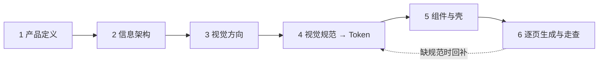

# 工作流 · 慢牛 Milo

> 本页上半是**本项目在用的版本**（2026-10-07 用户：「别忘了这个才是我们最初的工作流，如果项目对其有优化，可以改」）；
> 下半是用户最初给的模板原文（v1.4），不改，留作出处。两边冲突时以上半为准。
>
> **通用的协作工作流**：`docs/UIUX-AI协作工作流.md`（2026-10-10，用户：「把 Milo 开发以来踩过的坑、得出的优化思路……全部整理进去」「这一部分与 App 是并重的」）。那份是给任何项目用的完整工作流；本页只记 Milo 自己的做法。

## A. 每页五步（阶段 6 往后每一页、每一块新功能都走）

用户 2026-10-07 定：**五层模型 + 手指点击热区低保真线框 → Stitch 视觉参考 → 高保真搭建 → 用户视觉审查微调 → 定稿植入**。

| 步 | 做什么 | 产出 | 过关标准 |
|---|---|---|---|
| ① 五层 + 热区线框 | 先写五层分析（战略 → 范围 → 结构 → 框架 → 表现，写进页面文件头注释，先在线框说明里写草稿）；再出 2–3 个灰阶低保真方案，**叠手指热区**：拇指可达区底图（易 / 够得着 / 难）+ 每个可点元素的命中框与尺寸 | `design/wireframes/`（`?board=<页>`，截图 `screenshots/wireframes/<页>/`） | 每个方案标出 ① 第一优先信息 ② 主操作 ③ 导航；命中框全部 ≥ 48，主操作落在「易」区；没有死路按钮；用户选定一个 |
| ② Stitch 视觉参考 | 以选定线框 + 视觉语言 v2（`docs/DESIGN.md`）为输入，在 Stitch 出多个强度 / 变体 | `design/hifi/<页>/`（`build_stitch_*.py` + `tools/run_round.py`） | 只当参考，不当规范；用户选或混搭，选择理由记下来 |
| ③ 高保真搭建 | 用代码实现：缺的组件先进 `/playground`（全部交互态），规范缺口先补 Token / `DESIGN.md`；视效上有多种可能的，放进 `/preview` 方案台并排 | 组件、页面、方案台条目 | `npm run check` 全绿；无写死值；交互硬规则（`DESIGN.md` §9.6）过 |
| ④ 用户视觉审查微调 | 截图 + 录屏（MP4，GIF 在用户那边不动）用 `SendUserFile` 推给用户；方案台给链接，组合写在地址栏 | 截图、录屏、方案台链接 | 用户点头；每轮改动都重新截图 |
| ⑤ 定稿植入 | 选定的改成默认（旧方案留在方案台，作品集展示过程）；同步 `/demo` 路线文案、`/playground`、`DESIGN.md`、`HANDOFF.md`、`brief.md` 决定记录；门禁加断言 | 推 `main`，线上核对 | `npm run check` + `npm run gate` 全绿；线上 /demo 是新代码 |

## B. 本项目对模板的优化与差异

| 模板原文 | Milo 实际做法 | 为什么 |
|---|---|---|
| Figma 是视觉规范唯一源头，token 从 Figma 生成 | **仓库是唯一源头**：`design/tokens/tokens.json` → 生成 `tokens.css` / `src/styles/tokens.gen.ts`；Figma 由开发插件 `design/figma-plugin/` 从仓库导入（手改会被覆盖） | 改值只改一处，代码与 Figma 不会分叉；Figma 仍可用于展示 |
| 线框放 Figma Wireframes 页 | 线框是 `design/wireframes/` 里的 HTML（引擎实算数据 + MuscleWiki 真实人体），对比板带 ①②③ 标注和**手指热区** | 数据真实、可截图进门禁、热区能自动量尺寸 |
| token 预览页 | `/spec`（基础规范）+ `/playground`（全部组件 × 全部交互态 + 交互演示，82 个组件） | 规范和组件分开看 |
| 方向稿只做一次（阶段 3） | 新增 **`/preview` 方案台**：视效 / 组件待选方案实时渲染并排 + 自由组合（地址栏 `?o=&f=&s=`），选定后旧方案保留 | 视效类决定靠真渲染比，不靠静态图；作品集要展示过程 |
| 附录 F 单页门禁（手动） | 自动门禁：`npm run check`（tsc · vitest · 写死值检查 · Token 校验 · 构建）+ `npm run gate`（演示全流程 360 / 412 两种宽：命中区 ≥ 48、被压扁的块、横向溢出、对比度、各页断言）+ `shots:playground` | 每次改动都跑，不靠记忆 |
| `docs/tasks/` 一页一张任务卡 | 不单独写任务卡：本页五层分析写在页面文件头注释，路由 / 规格在 `ia.md`，计划在 `HANDOFF.md` §8 | 少一份会过期的文件 |
| `changelog.md` | 规范变更记在 `brief.md` 末尾的决定记录表与变更记录 | 决定只有一个出处 |
| 交付走 PR | 本机 `check` + 相关 `gate` 过了**直接推 `main`**，Vercel 自动部署，CI 后台跑（用户 2026-10-06） | PR / CI 来回太拖开发 |
| 深浅色 | 初版只做深色（brief v1.1.2）；2026-10-10 加全局浅色 = Token 验收：组件不改、换语义色映射；深色逐像素回归保护；浅色按角色对等（焦点色仍是荧光） | 见 v2 阶段 8 |
| （无） | **决定记录带用户原话**、授权分级（用户 / 授权 Claude 定 / Claude 判断可推翻） | 换窗口后靠原话判断 |
| （无） | **交接与防压缩**：`docs/handoff-session.md` 11 节，每次推 main 顺手更新；逼近上下文极限才换窗口 | 自动压缩丢过两次上下文 |
| （无） | **阶段 7 真机走查**：`docs/walkthrough-1.md`（29 条 → 归 10 组 → 6 个阶段，每阶段汇报） | 结构问题只在真机暴露 |
| （无） | **跨主题焦点对等检查**进门禁（`shoot_6a.py` 的 `LIME_SCAN`）、深色逐像素回归（`scripts/regress_dark.py`） | 浅色焦点被换成黑过一次 |
| 动效 | 加了 `docs/8motions.md` 八条动效作为验收参照 | 用户「效果第一」 |

---

# 附：用户最初的模板原文（v1.4，未改动）

# AI 辅助 UI/UX 设计与开发工作流模板

> 版本：v1.4 · 2026-10-01（新增附录 G：作品集手机样机流水线；只以产出门禁验收，不划分人与 AI 的职责）
> 适用：移动优先的 App / Web 产品，从 0 做到可交付 MVP，或对已有原型做规范化重构
> 首批套用：食律 NutriFlow v2、GYMLOG

---

## 0. 核心原则

1. **规范先于界面**：视觉规范冻结之前，不生成任何业务页面。
2. **Figma 是视觉规范的唯一源头**：规范在 Figma 中定义，token 从 Figma 生成，代码里不手改 token。
3. **一次只做一页**：每个页面独立生成，只依赖固定的上下文包，不依赖对话记录。
4. **缺规范先补规范**：页面需要规范里没有的东西时，先回 Figma 补，再继续生成。
5. **每一步有过关标准**：不过关，不进入下一步。
6. **只看产出，不分角色**：不规定某一步由人还是 AI 完成，产出通过该阶段的过关标准即可。

**工具**

| 用途 | 工具 |
|---|---|
| 视觉规范与设计稿 | Figma |
| 程序化读取 / 写入 Figma | Figma MCP |
| 视觉方向探索 | Stitch、Claude 等 |
| 代码生成 | vibe coding 客户端（Claude Code、Codex、Antigravity 等） |
| 默认技术栈 | React + Tailwind v4（可替换） |

---

## 1. 流程总览



| 阶段 | 核心产出 | 过关标准（摘要） |
|---|---|---|
| 1 产品定义 | `brief.md` | 产品目标可衡量；P0 功能都在闭环上；口径只有一个版本 |
| 2 信息架构 | `ia.md`、`mock/`、灰度线框 | 每个 P0 有规格；流程无断头页；低保真原型能点通 |
| 3 视觉方向 | `references.md`、方向稿 | 能说清与竞品的视觉差异；选定理由已记录 |
| 4 视觉规范 → Token | Figma 规范、`tokens.css`、`DESIGN.md` | 标杆页全部使用规范；对比度过 AA |
| 5 组件与壳 | 组件库、组件预览页 | 代码标杆页与 Figma 一致 |
| 6 逐页生成与走查 | 页面、截图、走查记录 | 每页过门禁；每条流程走通 |

**与用户体验要素五层模型的对应**

阶段 1–4 按 Garrett 五层模型自下而上推进：下层没定，上层不做。

| 五层 | 关注什么 | 对应阶段 |
|---|---|---|
| 战略层 | 用户需求、产品目标 | 1 产品定义 |
| 范围层 | 功能规格、内容需求 | 2 信息架构 |
| 结构层 | 信息架构、交互设计 | 2 信息架构 |
| 框架层 | 界面设计、导航设计、信息设计 | 2 信息架构 |
| 表现层 | 视觉设计 | 3 视觉方向、4 视觉规范 |

阶段 5、6 是把五层的结果落成代码。

---

## 2. 文件结构

### 2.1 项目仓库

```
project/
├── docs/
│   ├── brief.md            # 阶段 1
│   ├── ia.md               # 阶段 2
│   ├── references.md       # 阶段 3
│   ├── DESIGN.md           # 阶段 4：token 表达不了的规则
│   ├── changelog.md        # 规范变更记录
│   └── tasks/              # 阶段 6：一页一张任务卡
│       └── P01-home.md
├── mock/                   # 阶段 2：真实文案与 mock 数据
├── src/
│   ├── styles/tokens.css   # 阶段 4：从 Figma 生成，勿手改
│   ├── components/         # 阶段 5
│   └── pages/              # 阶段 6
└── screenshots/            # 各阶段截图，也是作品集素材
```

### 2.2 Figma 文件

```
<项目名> Design System
├── 00 Cover
├── 01 Wireframes     阶段 2：灰度线框与低保真原型
├── 02 Foundations    颜色 / 字体 / 间距 / 圆角 / 阴影 / 图标
├── 03 Components     组件 × 交互态
├── 04 Patterns       页面数据态模板（加载 / 空 / 错误…）
└── 05 Golden         1–2 个标杆页
```

---

## 3. 阶段详解

### 阶段 1 · 产品定义

**目标**：把产品说清楚。后续所有阶段用到的名词和数字，只从这里取。

**输入**：想法、已有原型、课程或比赛材料（如有）

**步骤**

1. 写一句话定位。
2. 定产品名、slogan、Logo。Logo 可以等阶段 3 选定方向后再定稿。
3. 写目标用户：人群 → 典型场景 → 痛点。
4. 写产品目标：用户价值和业务目标各 2–3 条，每条配一个衡量指标。用户价值的指标要能在 MVP 可用性测试中验证。
5. 画出核心体验闭环。
6. 列 MVP 功能清单，分 P0 / P1，并写明**不做什么**（非目标）。
7. 竞品与差异，3 个以内。
8. 统一口径表：核心术语、关键数值、单位写法、会员或权益规则。
9. 定 3–5 个品牌关键词（形容词），供阶段 3 使用。

**产出**：`docs/brief.md`（模板见附录 A）

**过关标准**

- [ ] 每条产品目标都有衡量指标
- [ ] 每个 P0 功能都能落到闭环的某一步
- [ ] 同一个概念只有一个名字，同一个数字只有一个版本
- [ ] 非目标已写明

---

### 阶段 2 · 信息架构（范围层 → 结构层 → 框架层）

**目标**：从阶段 1 的战略层出发，按五层模型依次定下范围层、结构层、框架层，得到一套能点通的灰度线框。它是阶段 3 视觉探索的底稿，也是阶段 6 的任务来源。

**原则**：自下而上，下层没定，上层不做。本阶段不讨论颜色、字体和风格。

**输入**：`docs/brief.md`（战略层：用户需求与产品目标）

#### 2.1 从战略层导出用户任务

1. 把 brief 里每个人群的痛点，改写成「用户要完成的任务」。
2. 每个任务至少对应一个 P0 功能。这张任务表是后面三层的检验标准。

#### 2.2 范围层：功能规格与内容需求

1. **功能规格**：每个 P0 功能写清描述、输入、输出、业务规则，以及边界情况（空、上限、失败、中断）。
2. **内容需求**：列出每个功能需要的内容，写清形式（文字、图片、数字、3D 等）、数量或长度、来源。
3. 按内容需求准备真实文案和 mock 数据，不使用占位文字。

#### 2.3 结构层：信息架构与交互设计

1. **信息架构**：定组织方式、页面清单（每页一个名字，取自口径表）、层级与全局导航，画出站点地图。
2. **交互设计**：为 3–5 条核心流程逐步写清「用户动作 → 系统反馈」，包括分支、异常、返回和中途退出。
3. 写路由表：页面、路由、入口、返回去向、刷新后保留的数据、需要覆盖的数据态。

#### 2.4 框架层：界面、导航与信息设计

1. 为每页画灰度线框，只表达三件事：
   - **界面设计**：页面上有哪些控件，放在哪里
   - **导航设计**：本页有哪些导航元素（顶栏、返回、底部 Tab 等）
   - **信息设计**：信息怎么分组，第一眼先看到什么
2. 线框统一放在 Figma 的 Wireframes 页。
3. 把核心流程在 Figma 里连成低保真原型，逐条点一遍。

表现层（视觉设计）在阶段 3、4 完成。

**产出**：`docs/ia.md`（模板见附录 B）、`mock/`、Figma Wireframes 页与低保真原型

**过关标准**

- [ ] 每个用户任务都有对应的 P0 功能和核心流程
- [ ] 每个 P0 功能都有规格，并写明边界情况
- [ ] 每个内容项都有来源，mock 数据足以填满每个页面
- [ ] 每页只有一个名字，入口可以逐个列出
- [ ] 每条核心流程首尾相接，包含异常与返回，没有断头页
- [ ] 每页都有线框，并标明第一优先信息和主操作
- [ ] 低保真原型能点通全部核心流程

---

### 阶段 3 · 视觉方向

**目标**：做规范之前先选定风格方向，避免在规范阶段反复推翻。

**步骤**

1. 收集参考：同品类 3 个 + 跨品类 2–3 个。
2. 每个参考标注「借鉴什么」：配色、信息密度、卡片样式、图标、插画、动效等。
3. 从阶段 2 的线框里选一个标杆页，通常是首页或核心结果页。
4. 以品牌关键词和参考为输入，在同一套标杆页布局上做出 2–3 个方向（可借助 Stitch、Claude 等工具）。
5. 选定一个方向，记录选择理由。

**注意**：方向稿只是参考图，不是规范。具体数值在阶段 4 的 Figma 规范中确定。

**产出**：`docs/references.md`、方向稿截图

**过关标准**

- [ ] 能用一句话说清与同类竞品的视觉差异
- [ ] 选定方向的理由已记录

---

### 阶段 4 · 视觉规范（Figma）→ Design Token

**目标**：得到一套既能在 Figma 中直接使用、又能被程序准确读取的视觉规范，并从中生成对应的 token。

#### 4.1 Figma 规范

1. **Foundations**：颜色、字体、间距、圆角、阴影、图标风格。
2. **Components**：组件及其交互态。
3. **Patterns**：页面数据态模板。
4. **Golden**：1–2 个标杆页，只使用规范里的变量、样式和组件。

**两张状态矩阵，必须分开做**

| 类型 | 作用对象 | 典型状态 | Figma 做法 |
|---|---|---|---|
| 组件交互态 | 按钮、输入框、卡片等 | 默认 / 悬停 / 按压 / 聚焦 / 禁用 / 加载 | 组件 variants |
| 页面数据态 | 整页或区块 | 加载中 / 空 / 错误 / 无权限 / 部分数据 | Patterns 页模板 |

**Figma 规则**（token 能准确生成的前提）

- 颜色、字体、间距、圆角用变量或样式定义，不在图层上直接填值。
- 变量按用途命名，如 `color/text/secondary`，而不是 `gray-2`。色值谁都读得到，但只有名字能说明用途。
- 需要深色模式时，用变量的 mode（Light / Dark）。
- 组件和 variant 用英文命名，与将来的代码组件同名。

#### 4.2 Figma → Token

1. 通过 Figma MCP 读取变量、样式和组件。
2. 生成 `src/styles/tokens.css`（默认 Tailwind v4 `@theme` 格式）。
3. 生成 token 预览页：色板、字阶、间距、圆角、阴影，并标注文字与背景的对比度。
4. 在 `DESIGN.md` 中写入组件对照表和使用规则。

使用 AI 生成时，指令模板见附录 D。

#### 4.3 核对与冻结

1. 对照 Figma 检查 token 预览页。
2. 对比度不达标的，回 Figma 改，再重新生成。
3. 冻结为 v1.0，记入 `changelog.md`。

**产出**：Figma 规范文件、`tokens.css`、token 预览页、`DESIGN.md`（骨架见附录 C）

**过关标准**

- [ ] 标杆页中没有未使用变量或样式的颜色、字号
- [ ] 正文与次要文字对比度 ≥ 4.5:1（WCAG AA）
- [ ] token 预览页与 Figma 一致
- [ ] `DESIGN.md` 已写明字号用途、组件对照表、两张状态矩阵、动效原则、文案语气

---

### 阶段 5 · 组件与壳

**目标**：在写业务页面之前，把所有页面共用的东西做完。

**步骤**

1. 按 Figma 组件实现代码组件，名称和 variant 一一对应。
2. 实现全局壳：导航、页头、页面容器、主题切换。
3. 做组件预览页（如 `/playground`），展示全部组件 × 全部交互态。
4. 用代码重建标杆页，与 Figma 截图并排比对。

**产出**：`src/components/`、组件预览页、代码版标杆页

**过关标准**

- [ ] 组件预览页覆盖全部组件 × 全部交互态
- [ ] 代码版标杆页与 Figma 目视一致
- [ ] 代码中没有写死的色值和尺寸，只引用 token

---

### 阶段 6 · 逐页生成与走查

**目标**：按流程逐页生成业务页面，每一页的质量都可控。

**组织方式**：按核心流程排序，一次只做一页。一条流程内的页面全部完成后，做一次流程级走查。

#### 6.1 每页只依赖上下文包

每页独立生成，输入只来自下表中的文件，不依赖对话记录或临时约定。

| 内容 | 来源 |
|---|---|
| 规范规则 | `docs/DESIGN.md` |
| Token | `src/styles/tokens.css` |
| 可用组件 | `src/components/`（或 `DESIGN.md` 中的对照表） |
| 本页结构 | `docs/ia.md` 中本页的路由、功能规格与流程步骤 |
| 本页线框 | Figma Wireframes 页中本页的截图 |
| 本页数据 | `mock/` 中对应文件 |
| 视觉参照 | 标杆页截图 |
| 本页任务 | `docs/tasks/<本页>.md`（模板见附录 E） |

#### 6.2 每页门禁

完成后逐项检查附录 F，全部通过才算这一页完成。

#### 6.3 规范缺口处理

页面需要规范里没有的颜色、组件或状态时：

1. 停止生成。
2. 回 Figma 补充。
3. 重新生成 token 或组件。
4. 记入 `changelog.md`。
5. 继续生成页面。

**禁止在页面代码里临时发明样式。**

#### 6.4 先在 Figma 完成的页面

先在 Figma 中完成的页面，同样只使用规范里的变量和组件，再通过 Figma MCP 读取后实现为代码，并过同一套门禁。

#### 6.5 流程级走查

- [ ] 流程从头到尾可以走通
- [ ] 返回行为与 `ia.md` 一致
- [ ] 数据在页面之间正确传递，刷新后按约定保留
- [ ] 按 Nielsen 10 条启发式原则走查，记录问题与修复

**产出**：`src/pages/`、每页截图、走查记录

---

## 4. 规范变更规则

1. 所有视觉变更从 Figma 开始。
2. Figma 改完 → 重新生成 `tokens.css` → 在预览页核对 → `changelog.md` 记一条。
3. 每条记录写清：日期、改了什么、影响哪些页面。

---

## 5. 作品集素材沉淀

每个阶段结束时顺手存档，不要留到最后补。

| 阶段 | 可沉淀的素材 |
|---|---|
| 1 产品定义 | 定位、人群与场景、产品目标、功能优先级 |
| 2 信息架构 | 用户任务表、站点地图、核心流程图、线框与低保真原型 |
| 3 视觉方向 | 参考板、方向对比 |
| 4 视觉规范 | 规范页、组件状态矩阵、token 预览页 |
| 5 组件与壳 | 组件预览页、标杆页 Figma 与代码对照 |
| 6 逐页生成 | 页面截图、走查问题与修复记录 |

**作品集页面里的手机**：用 AI 出的真实样机，把项目自己的截图透视贴进屏幕，不用矢量边框去画。整条流水线（出图 → 自查 → 抠图 → 贴屏 → 合成 → 入页）见附录 G。

---

## 附录

### 附录 A · `brief.md` 模板

```markdown
# <产品名> 产品 Brief

## 一句话定位

## 命名
- 中文名 / 英文名：
- Slogan：
- Logo：

## 平台
- 目标平台与主要尺寸：

## 目标用户
| 人群 | 典型场景 | 痛点 |
|---|---|---|

## 产品目标
| 类型 | 目标 | 衡量指标 |
|---|---|---|
| 用户价值 | | |
| 业务目标 | | |

## 核心体验闭环
A → B → C → D

## MVP 功能清单
| 优先级 | 功能 | 对应闭环环节 |
|---|---|---|
| P0 | | |
| P1 | | |

### 不做（非目标）
-

## 竞品与差异
| 竞品 | 他们怎么做 | 我们的差异 |
|---|---|---|

## 统一口径表
| 类别 | 统一写法 | 说明 |
|---|---|---|
| 术语 | | |
| 数值 | | |
| 单位 | | |
| 权益 | | |

## 品牌关键词
-
```

### 附录 B · `ia.md` 模板

````markdown
# <产品名> 信息架构

> 上游：brief.md v1.0

## 0. 用户任务（战略层导出）
| ID | 人群 | 用户要完成的任务 | 对应 P0 功能 | 对应流程 |
|---|---|---|---|---|
| T1 | | | | F1 |

## 1. 功能规格（范围层）

### <功能名>
- 描述：
- 输入：
- 输出：
- 业务规则：
- 边界情况：空 / 上限 / 失败 / 中断
- 相关口径：见 brief.md 统一口径表

## 2. 内容需求（范围层）
| 内容项 | 所属功能 | 形式 | 数量 / 长度 | 来源 | mock 文件 |
|---|---|---|---|---|---|

## 3. 站点地图（结构层）
- 组织方式：
- 全局导航：

```
首页
├── 页面 A
│   └── 页面 A-1
└── 页面 B
```

## 4. 页面清单与路由（结构层）
| ID | 页面名 | 路由 | 入口 | 返回去向 | 刷新后保留 | 需覆盖的数据态 |
|---|---|---|---|---|---|---|
| P01 | 首页 | / | 底部导航 | — | 用户状态 | 加载 / 空 |

## 5. 核心流程（结构层）

### F1 <流程名>
| 步骤 | 页面 | 用户动作 | 系统反馈 | 分支 / 异常 |
|---|---|---|---|---|
| 1 | P01 | | | |

## 6. 页面框架（框架层）
| 页面 | 线框 | 第一优先信息 | 主操作 | 导航元素 |
|---|---|---|---|---|
| P01 | Figma Wireframes / P01 | | | 底部 Tab |
````

### 附录 C · `DESIGN.md` 骨架

```markdown
# <产品名> Design Rules

> Token 源头：Figma「<文件名>」· 版本 v1.0

## 1. 字号用途
| 样式名 | 用在哪里 |
|---|---|

## 2. 颜色使用规则

## 3. 组件对照表
| Figma 组件 / variant | 代码组件 / props |
|---|---|

## 4. 组件交互态定义

## 5. 页面数据态定义
| 状态 | 触发条件 | 呈现方式 |
|---|---|---|

## 6. 动效原则

## 7. 文案语气

## 8. 禁止事项
```

### 附录 D · Token 生成指令模板（使用 AI 生成时）

```text
读取 Figma 文件 <链接> 中 Foundations 与 Components 页的变量、样式和组件。

1. 生成 src/styles/tokens.css，使用 Tailwind v4 的 @theme 格式；
   有 Light / Dark mode 时，深色值写在 .dark 选择器下。
2. 命名与 Figma 保持一致（color/text/secondary → --color-text-secondary）。
3. Figma 中用样式而非变量表达的值（阴影、字体组合）也转成 token，
   并在注释里标明来源样式名。
4. 生成 token 预览页 /tokens：色板、字阶、间距、圆角、阴影；
   标注文字色与背景的对比度，不达 4.5:1 的标红。
5. 在 docs/DESIGN.md 中更新组件对照表。
6. 不要自行新增 Figma 中没有的值；发现缺失或冲突时，列出来问我。
```

### 附录 E · 页面任务卡模板

```markdown
# P03 <页面名>

- 所属流程：F1
- 路由 / 入口 / 返回：见 ia.md §4 P03
- 功能规格：见 ia.md §1
- 线框：Figma Wireframes / P03
- 使用组件：
- 数据：mock/xxx.json
- 需覆盖的数据态：加载 / 空 / 错误
- 交互说明：
- 完成标准：通过附录 F 门禁
```

### 附录 F · 单页门禁清单

- [ ] 只使用 `tokens.css` 中的 token，没有写死的色值和尺寸
- [ ] 只使用组件库中的组件，没有另写一套相似组件
- [ ] 任务卡要求的数据态全部实现，可以逐个切换查看
- [ ] 文案与数据来自 `mock/`，没有占位文字
- [ ] 深浅色（如有）都检查过
- [ ] 在真机或目标设备上检查过
- [ ] 已截图存入 `screenshots/`

写死值的快速检查：

```bash
grep -rnE "#[0-9a-fA-F]{3,8}\b|\[[0-9.]+px\]" src/pages src/components
```

### 附录 G · 作品集手机样机流水线（AI 出图 → 全自动抠图贴屏 → 入页）

**用途**：作品集页面里的手机，用 AI 出的真实样机，把项目 `screenshots/` 里的真实截图按透视贴进屏幕。输出是透明底 PNG（已含投影），可直接嵌进 SVG / HTML。食律 P12 是首次完整跑通。

**原则**

1. **素材里只有手机。** 阴影、地面、遮挡关系一律不让 AI 出，由合成脚本统一生成。
2. **一张图一台。** 扇形、并排等多台组合，用单台素材在脚本里拼。
3. **屏幕是纯色绿幕**，不是真实界面。
4. **对位靠拟合，不靠轮廓直线求交。** 被挡住的边，直线是错的。
5. **每一步有可量化的自查。** 不过关就重出素材，不要在抠图代码里硬补。

**流程**

| 步 | 做什么 | 产出 | 过关标准 |
|---|---|---|---|
| G1 出素材 | 用 G.2 的提示词，每个姿势出 2 张备选，长边 ≥ 2752 | `参考/mockups/M1a.jpg` 等 | 能放进 G2 的自查 |
| G2 素材自查 | 目视 + 数值（见下） | 通过 / 重出 | 全部满足 |
| G3 抠图 | IS-Net 出机身蒙版，与绿屏取并集并补洞；引导滤波让边缘吸附真实轮廓；前景色去污 | 机身 alpha | 浅底、深底各放大 400% 检查，无脏边、无白边、无绿边 |
| G4 屏幕拟合 | 用「圆角矩形屏幕 + 4 点透视」的蒙版去最小二乘拟合绿幕蒙版，得到屏幕四角；截图透视贴入 | 贴好屏的单台 RGBA | 截图填满整块屏幕，不露绿，不被切掉状态栏 |
| G5 合成 | 单台：接触阴影 + 朝右下拖的地面投影；多台：前台对后台的遮挡阴影 | 页面可用的透明 PNG | 阴影方向与页面光线一致；每台屏幕四角完整 |
| G6 入页 | 用机身包围盒（不含阴影）对齐版心，不要用整张 PNG 的边界 | 页面 | 阴影尾巴不压到页脚和文字 |

**G2 素材自查**

- [ ] 背景四角平均亮度 ≥ 240，四角方差 ≤ 3（纯白、无渐变、无暗角）
- [ ] 屏幕绿色均值接近 (0, 255, 0)，且每台只有一个绿色连通域
- [ ] 一张图只有一台手机，四周留白 ≥ 8%
- [ ] 放大 400% 看机身下缘：外侧第一个像素就是纯白，没有灰带（**没有接触阴影、没有 AO**）
- [ ] 屏幕四个圆角都完整，灵动岛在，没有任何东西挡住屏幕
- [ ] 边缘锐利，无光晕、无运动模糊；边框高光没有曝成纯白（否则改用灰底变体）
- [ ] 通用款，无 logo

**G.2 提示词模板**（每条前面都加；食律的完整版在 `AIGC视觉参考提示词.md` §4）

```text
Professional product render of a modern smartphone: generic flagship design, graphite black aluminum frame, thin uniform black bezel, rounded corners, a small black pill-shaped camera cutout at the top center of the screen, no logo, no brand marks. The entire screen is a perfectly flat, uniform, fully lit pure chroma-key green #00FF00 with no reflections, no glare, no gradient, no UI and no text; all four rounded screen corners are fully visible and nothing covers the screen; no green glow on the bezel. Exactly one phone, floating in mid-air with generous empty margin around it, against a pure seamless flat white #FFFFFF background. Completely shadowless: no cast shadow, no contact shadow, no ambient occlusion, no floor, no ground plane, no reflection, no vignette, no gradient on the background. Even soft studio lighting, gentle highlights on the metal frame that never blow out to pure white. Crisp, sharp silhouette edges against the white background, no halo, no glow, no outline. Long lens 85–100mm, minimal perspective distortion, sharp focus edge to edge, no motion blur, no depth-of-field blur, photorealistic, minimal, high resolution.
```

姿势（接在通用提示词后面，全部单台、悬空）：正面直立（M1）；向左转约 25°（M2，露右边框）；向右转约 25°（M3，露左边框）；后仰约 15° 斜靠（M5）；平躺俯拍 90°（M6）。三台扇形 = M3 + M1 + M2 在脚本里拼。

负面词：`shadow, drop shadow, contact shadow, ambient occlusion, floor, ground, table, reflection, vignette, gradient background, halo, glow, outline, multiple phones, overlapping phones, hands, people, props, text, logo, brand name, screen glare, green light spill, fisheye, heavy bokeh, motion blur`

**可选：黑白双图。** 若工具支持「编辑这张图」，让它在手机一像素不变的前提下把白底改成纯黑，再用同一台手机在白底和黑底上的差值算每个边缘像素的精确透明度。工具一旦改动了手机本身，这条作废，只用白底图。

**G.3 症状 → 原因 → 处理**

| 症状 | 原因 | 处理 |
|---|---|---|
| 机身下缘、台与台的接缝有脏边 | 素材里有接触阴影 / AO，或台与台互相遮挡；抠图模型分不清机身和阴影 | 重出素材（G.2），不要去调阈值 |
| 截图四边和屏幕对不上，某一条边偏 | 用轮廓拟合直线再求交；被遮挡的那条边本来就是错的 | 改用蒙版拟合（G4）；被挡住的区域不参与计算 |
| 优化后四角完全没动 | scipy `least_squares` 的相对步长在 x = 0 时退化为 0，雅可比全零 | 手写有限差分（绝对步长 0.5 px）；残差向量长度必须固定，排除区用乘 0，不要用索引 |
| 被挡住的那条边漂移 | 该边没有像素约束 | 加一个宽高比软约束，只设「不能比平面更宽、不能窄于一半」的单侧区间，因为转角会让二维宽高比变窄 |
| 屏幕边缘有锯齿或绿线 | 绿幕蒙版是二值阈值 | 屏幕透明度取「绿度」g − max(r, b) 的连续值；截图 `BORDER_REPLICATE`；机身上全局去绿 |
| 两台之间的细缝透出背景 | 蒙版在窄缝处丢失 | 多台素材对机身蒙版做 ~11 px 闭运算；单台不要做（会糊掉按键） |
| 白底上有白色毛边 | 引导滤波后的半透明圈 | 收紧阈值（0.55 → 0.85）并做前景色去污 |
| 大图拟合很慢 | 每次迭代都要对整图做透视变换 | 缩到长边 ≤ 1000 拟合，四角按比例放回 |
| SVG 里图片编码含 `NPS` | 作者的自检字串 | 换一个缩放宽度重试 |

**为什么不换抠图项目**：IS-Net、U²-Net、BiRefNet、MODNet 等开源抠图模型都只分「主体 / 背景」，投影被当成背景，换哪个都不会输出半透明投影。所以投影必须在合成阶段自己生成，素材里也就不该有。

**参考实现与依赖**（食律仓库 `生成脚本/`）

- `mock_cut.py`：G3 + G4。模型 IS-Net（xuebinqin/DIS，经 danielgatis/rembg 发布的 `isnet-general-use.onnx`，178 MB，不进 git，缺失时自动下载），onnxruntime 推理。
- `mock_compose.py`：G5。`single()` 单台加投影；`fan3()` 三台扇形。
- 依赖：`onnxruntime`、`scipy`、`opencv-python`、`numpy`、`Pillow`。

**单页门禁（样机部分）**

- [ ] 素材通过 G2
- [ ] 浅底、深底各放大 400% 检查过四角圆角、灵动岛、机身下缘、按键
- [ ] 截图与屏幕四边无缝：无露绿，无露出截图外的黑边，状态栏未被切
- [ ] 阴影方向与页面光线一致（光从左上，阴影向右下），阴影尾巴不压文字和页脚
- [ ] 多台组合：前台对后台有遮挡阴影，每台屏幕四角完整
- [ ] SVG 以 `</svg>` 结尾，XML 解析通过，不含 `NPS`
